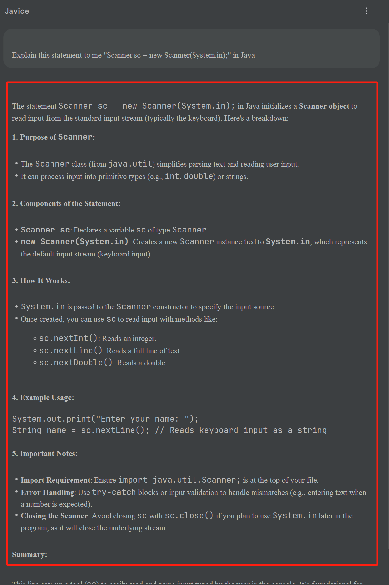
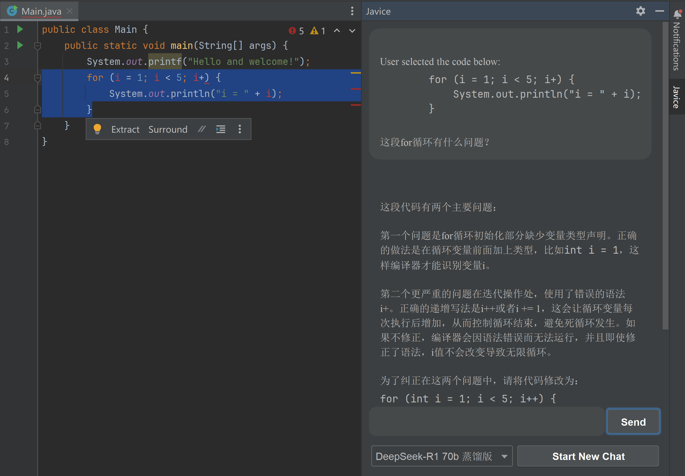

# Javice

项目网址：https://github.com/LatiosInAltoMare/IDEA-Plugin-Javice

<!-- Plugin description -->
**Javice**（Intelligent Chat Assistant for **Jav**a No**vice** ）是由南科大计算机系SQLab实验室学生团队基于大语言模型的智能问答工具，面对南科大CS109课程学生开放，用于辅助学生的编程学习过程。该工具实现了集成于IntelliJ IDEA开发环境中的客户端交互界面，更方便学生在学习过程中使用。目前Javice支持调用两种大语言模型，包括 Deepseek-R1-671b 模型，以及 DeepSeek-R1-Llama 70b 蒸馏模型。该工具**免费**向课程学生开放且**更为稳定**，可以为学生提供高效且智能的学习辅助。
<!-- Plugin description end -->

## 安装

####  通过`jar`包安装

`jar`包（全称为 Java Archive）是一种用于打包、分发、管理 Java 程序和库的文件格式。本质上来说，它是一个使用 ZIP 格式压缩的文件。我们已经将插件打包为`jar`包并发布在GitHub上，可以直接使用`jar`包进行安装

**步骤一：下载`jar`包**

- 下载地址：https://github.com/LatiosInAltoMare/IDEA-Plugin-Javice/blob/master/Javice-1.0.jar

- 进入页面后点击下载按钮

**步骤二：安装`jar`包**

- 首先进入设置/插件界面

- 随后选择`Install Plugin from Disk`

- 选择先前下载的`jar`包文件，点击`OK`，即可安装成功

## 使用

安装后可以在右边栏找到插件，点开即可使用

#### 初次使用
由于资源有限，目前该工具目前仅面向 2025 Spring CS109 课程中的同学。使用需要连接校园网，且在初次使用需要API key。

- 访问API key后台管理界面  http://starrail.sqlab.cra.moe:5001/ ，点击 `Get Started`

  

- 登录（用户名和初始密码为学号）

  

- 点击 `Generate New API Key` 生成新的API key

  

- 复制API key

  

- 打开IDEA，点击右下角的`Javice`

  

- 粘贴刚刚复制的API key

#### 问答功能

当成功完成身份验证，就可以开始使用 Javice. 

- 向输入框中输入提问

  

- 点击 `Send` 按钮，并等待输出

  

  

- 查看回答

- 

#### 模型选择

为了提高工具的稳定性，在使用过程中可以选择不同的模型对问题进行回答。通过点击模型选择栏对模型进行选择。

#### 代码选中

如果你在编辑器内选中了某段代码，则它会自动作为提示词传入大模型中

## 注意事项
**课程作业诚信检查**

本工具旨在辅助课程学习，严禁直接使用本工具生成的代码作为作业提交结果。若发现任何直接采用模型生成代码作为作业提交的行为，将依据南方科技大学计算机科学与工程系本科生课程学术不端行为管理规定进行处理。

- 允许的使用行为：

  - 通过使用该工具进行：

    - 辅助修复问题代码

    - 理解概念知识

    - 为代码生成测试样例

      ...

- 不允许的使用行为：

  - **直接**通过AI Assistant 生成 Assignment 的答案

​	

**提问相关性**

由于计算资源有限，请在使用本工具时仅提出与课程相关的问题。

**信息收集**

所有用户的交互信息将被收集，并仅用于教学分析和科研研究。所有涉及用户敏感信息的内容将经过匿名化处理。

## 问题反馈

如果你在使用过程中遇到任何问题以及对插件有任何建议，可以选择在GitHub仓库中提出Issue，或者使用邮件联系开发者，我们会尽快作出答复：

蒋怀德：12212915@mail.sustech.edu.cn

何星熠：12211429@mail.sustech.edu.cn

周一凡：12332419@mail.sustech.edu.cn

冯梓桐：12212410@mail.sustech.edu.cn

## 部署、测试细节

如果你对于部署以及测试的细节感兴趣，请查看我们的[部署文档](https://github.com/LatiosInAltoMare/IDEA-Plugin-Javice/blob/master/deploy_scheme.md)。

## 开源协议

本插件采用[intellij-platform-plugin-template](https://github.com/JetBrains/intellij-platform-plugin-template)模板编写，并采用[MIT开源协议](https://github.com/LatiosInAltoMare/Javice/blob/main/LICENSE)进行开源

