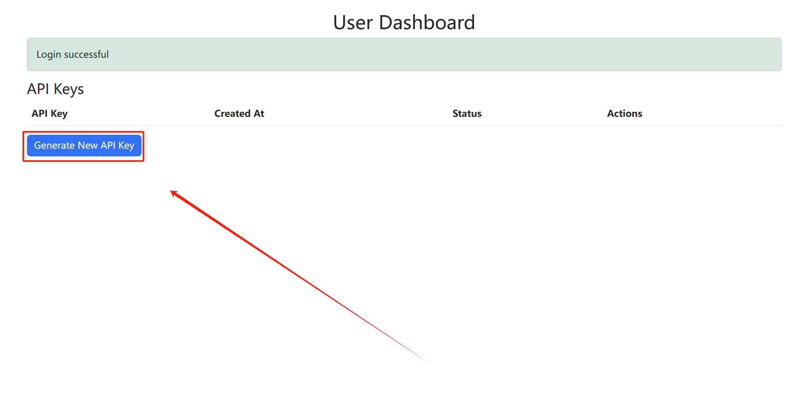
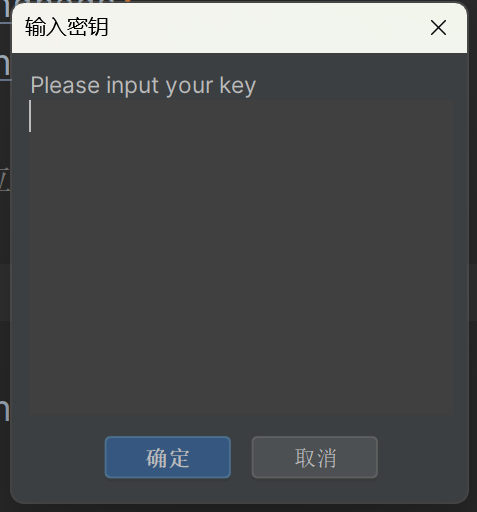
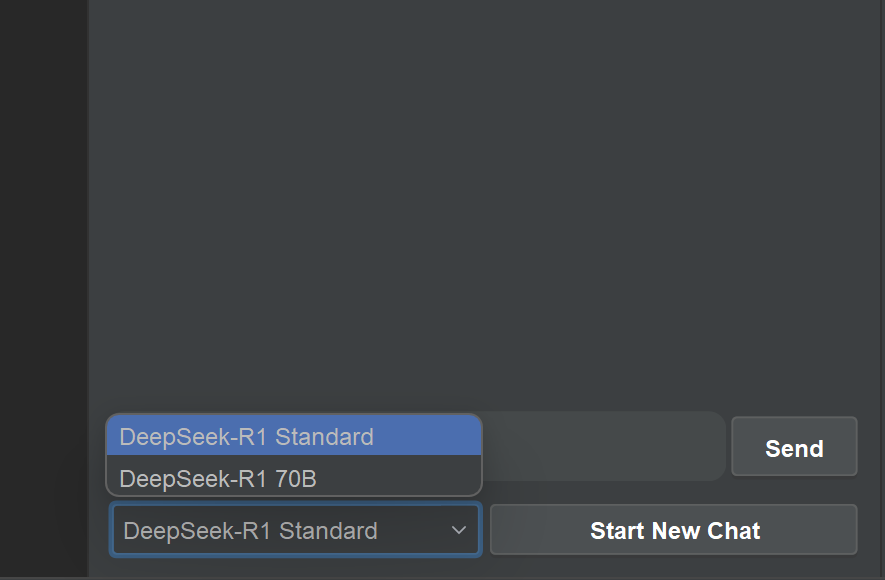

# Javice

Project URL: [https://github.com/LatiosInAltoMare/IDEA-Plugin-Javice](https://github.com/LatiosInAltoMare/IDEA-Plugin-Javice)

<!-- Plugin description -->
**Javice** (Intelligent Chat Assistant for **Jav**a No**vice**) is an intelligent Q&A tool based on a large language model, developed by the SQLab student team of the Computer Science Department, SUSTech. It is designed for students enrolled in the CS109 course at SUSTech to assist in their programming learning process. The tool integrates a client interaction interface into the IntelliJ IDEA development environment, making it more convenient for students to use during their studies. Currently, Javice supports two large language models: Deepseek-R1-671b and DeepSeek-R1-Llama 70b distilled model. The tool is **free** for course students and is **more stable**, providing efficient and intelligent learning assistance.
<!-- Plugin description end -->

## Installation

#### Installing via `jar` Package

A `jar` file (short for Java Archive) is a file format used for packaging, distributing, and managing Java programs and libraries. Essentially, it is a compressed file using the ZIP format. We have packaged the plugin as a `jar` file and released it on GitHub. You can install it directly using the `jar` package.

### Step 1: Download the `jar` Package

- Download link: https://github.com/LatiosInAltoMare/IDEA-Plugin-Javice/releases/download/v1.0.1/Javice-1.0.1.jar
  
### Step 2: Install the `jar` Package

- First, go to **Settings > Plugins**

  

- Then, select **Install Plugin from Disk**

  

- Choose the previously downloaded `jar` file, click `OK`, and the installation will be completed

  

## Usage

After installation, you can find the plugin in the right sidebar. Click to open and use it.

### First-Time Use

Due to limited resources, this tool is currently only available to students enrolled in the **2025 Spring CS109 course**. It requires a campus network connection and an **API key** for first-time use.

- Visit the API key management page: http://starrail.sqlab.cra.moe:5001/, and click `Get Started`

  

- Log in (username and initial password are your student ID)

  

- Click `Generate New API Key` to create a new API key

  

- Copy the generated API key

  

- Open IntelliJ IDEA, click `Javice` in the bottom-right corner

  

- Paste the copied API key

  

### Q&A Functionality

Once authentication is successfully completed, you can start using Javice.

- Enter your question in the input box

  

- Click the `Send` button and wait for the response

  

  

- View the answer

  

### Model Selection

To improve stability, you can choose different models to answer your questions. Click the model selection dropdown to switch models.

### Code Selection

If you select a piece of code in the editor, it will automatically be used as a prompt for the model.

## Important Notes

### Academic Integrity for Course Assignments

This tool is designed to assist with course learning. It is strictly **prohibited** to submit code generated by this tool as assignment solutions. Any direct use of AI-generated code for assignment submissions will be handled according to the **Regulations on Academic Misconduct in courses for Undergraduate Students** of the SUSTech Computer Science and Engineering Department.

- What is OK？

  - It is OK to use AI assistant to help you :

    - Debug your code

    - Understand the concept

    - Generate test cases

      ....

- What should be avoid?

  - **Directly** use AI assistant to generate the assignment answer for you 

### Relevance of Questions

Due to limited computational resources, please use this tool only for **course-related questions**.

### Data Collection

All user interactions will be collected and used **only** for educational analysis and research. Any user-sensitive information will be anonymized.

## Feedback

If you encounter any issues while using the plugin or have suggestions, you can submit an **Issue** on the GitHub repository or contact the developers via email. We will respond as soon as possible:

- Huaide Jiang: 12212915@mail.sustech.edu.cn
- Xingyi He: 12211429@mail.sustech.edu.cn
- Yifan Zhou: 12332419@mail.sustech.edu.cn
- Zitong Feng: 12212410@mail.sustech.edu.cn

## Deployment and Testing Details

If you are interested in deployment and testing details, please refer to our [Deployment Documentation](https://github.com/LatiosInAltoMare/Javice/blob/main/deploy_scheme.md).

## Open Source License

This plugin is developed using the [intellij-platform-plugin-template](https://github.com/JetBrains/intellij-platform-plugin-template) and is open-sourced under the [MIT License](https://github.com/LatiosInAltoMare/Javice/blob/main/LICENSE).

